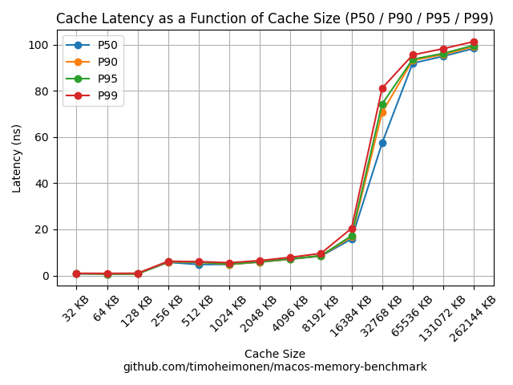
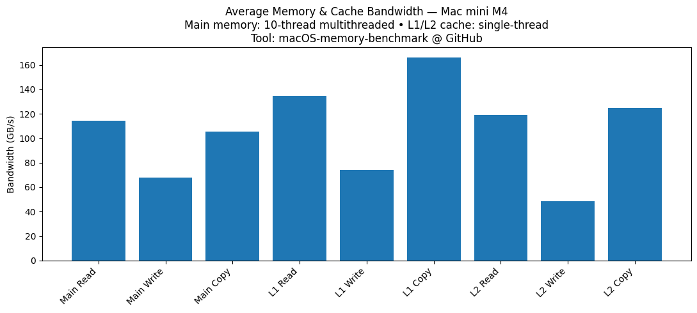

# macOS Apple Silicon Memory Benchmark

    

Copyright 2025-2026 Timo Heimonen <timo.heimonen@proton.me>  
License: GPL-3.0 license  
  
**Low-level tool** to measure memory read/write/copy bandwidth, cache/main memory latency, and access pattern performance on macOS Apple Silicon (ARM64).
  
## Description

This tool measures memory performance on macOS Apple Silicon systems. It provides comprehensive benchmarks for:

1. **Main Memory Bandwidth**: How fast data can be read, written, and copied between large memory blocks (measures DRAM performance).
2. **Cache Bandwidth**: How fast data can be read, written, and copied within L1 and L2 cache levels.
3. **Main Memory Latency**: The average time it takes to access memory (measures DRAM access time).
4. **Cache Latency**: The average time it takes to access L1 and L2 cache levels.
5. **Access Pattern Performance**: Performance across different memory access patterns (sequential, strided, random) to analyze prefetcher effectiveness and cache behavior.

The tool automatically detects your system's cache sizes and uses optimized assembly code for accurate measurements. All tests include warm-up runs to ensure stable and consistent results.

## Why This Tool?

The primary motivation for developing this tool is to provide a straightforward and reliable method for measuring and comparing the memory performance characteristics across different generations of Apple Silicon chips (M1, M2, M3, M4, M5, etc.).

Many general-purpose benchmarks are not specifically designed to expose Apple Silicon–specific cache behavior or access patterns.
This tool focuses on:
- Native ARM64 execution (no Rosetta)
- Cache-size aware access patterns
- mmap-based memory allocation

## Disclaimer

**Use this software entirely at your own risk.** This tool performs intensive memory operations. The author(s) are not responsible for any potential system instability, data loss, or hardware issues resulting from its use.  

## Target Platform

macOS on Apple Silicon.

## Features

* **Main Memory Bandwidth**: Measures read, write, and copy speeds using all available CPU cores for maximum throughput (customizable with `-threads` parameter).
* **Cache Bandwidth**: Measures L1 and L2 cache read, write, and copy speeds. By default uses single-threaded tests for accuracy, but can be configured with `-threads` parameter.
* **Memory Latency**: Measures access latency for both main memory and cache levels.
* **Access Pattern Analysis**: Tests different memory access patterns (sequential forward/reverse, strided, random) to analyze prefetcher effectiveness and cache behavior.
* **Advanced Statistics**: When running multiple test loops, provides detailed statistics including percentiles (P50/P90/P95/P99) and standard deviation.
* **Automatic Cache Detection**: Automatically detects and uses your system's L1 and L2 cache sizes.
* **JSON Export**: Save benchmark results to JSON format for further analysis or visualization.
* **Optimized Performance**: Uses highly optimized assembly code for accurate and fast measurements.

## Install with Homebrew

In the Terminal, Run:  
```bash
brew install timoheimonen/macOS-memory-benchmark/memory-benchmark
```

## Prerequisites

* macOS (Apple Silicon).
* Xcode Command Line Tools (includes `clang++` compiler and `as` assembler).
    * Install with: `xcode-select --install` in the Terminal.

## Building

In the Terminal, go to the directory with source code. Run:

**Compile C++/ASM code:**
    ```bash
    make
    ```
This makes the program file named `memory_benchmark`.

## Testing

Prerequisites:
```bash
brew install googletest
```

Run:
```bash
make test
```

(unit tests covering config, buffers, memory, benchmarks, and messages.)

## Usage

In the Terminal, go to the directory with `memory_benchmark` and use these commands:

1. **Help**
    ```bash
    ./memory_benchmark -h
    ```
    Example output:
    ```text
    Copyright 2025-2026 Timo Heimonen <timo.heimonen@proton.me>
    Version: 0.52.5 by Timo Heimonen <timo.heimonen@proton.me>
    License: GNU GPL v3. See <https://www.gnu.org/licenses/>
    This program is free software: you can redistribute it and/or modify
    it under the terms of the GNU General Public License as published by
    the Free Software Foundation, either version 3 of the License, or
    (at your option) any later version.
    This program is distributed in the hope that it will be useful,
    but WITHOUT ANY WARRANTY; without even the implied warranty of
    MERCHANTABILITY or FITNESS FOR A PARTICULAR PURPOSE.
    Link: https://github.com/timoheimonen/macOS-memory-benchmark

    Usage: ./memory_benchmark [options]
    Options:
      -iterations <count>   Number of iterations for R/W/Copy tests (default: 1000)
      -buffersize <size_mb> Size for EACH of the 3 buffers in Megabytes (MB) as integer (default: 512).
                            The maximum allowed <size_mb> is automatically determined such that
                            3 * <size_mb> does not exceed ~80% of available system memory.
      -count <count>        Number of full loops (read/write/copy/latency) (default: 1).
                            When count > 1, statistics include percentiles (P50/P90/P95/P99) and stddev.
      -latency-samples <count> Number of latency samples to collect per test (default: 1000)
      -threads <count>      Number of threads to use for benchmarks (default: detected
                            CPU core count). Applies to all benchmarks including cache tests.
                            If specified value exceeds available cores, it will be capped to
                            the maximum number of cores with a warning.
      -cache-size <size_kb> Custom cache size in Kilobytes (KB) as integer (16 KB to 524288 KB).
                            Minimum is 16 KB (system page size). When set, skips automatic
                            L1/L2 cache size detection and only performs bandwidth and latency
                            tests for the custom cache size.
      -patterns             Run pattern benchmarks (sequential forward/reverse, strided,
                            and random access patterns). When set, only pattern benchmarks
                            are executed, skipping standard bandwidth and latency tests.
                            use with -buffersize <size_mb> to set the buffer size for the pattern benchmarks.
      -only-bandwidth       Run only bandwidth tests (read/write/copy for main memory and cache).
                            Skips all latency tests. Cannot be used with -patterns, -cache-size,
                            or -latency-samples.
      -only-latency         Run only latency tests (main memory and cache latency).
                            Skips all bandwidth tests. Cannot be used with -patterns or -iterations.
      -non-cacheable        Apply cache-discouraging hints to src/dst buffers.
                            Uses madvise() hints to discourage caching, but does NOT provide
                            true non-cacheable memory (user-space cannot modify page tables).
                            Best-effort approach that may reduce but not eliminate caching.
      -output <file>        Save benchmark results to JSON file. If path is relative,
                            file is saved in current working directory.
      -h, --help            Show this help message and exit

    Example: ./memory_benchmark -iterations 2000 -buffersize 1024 -output results.json
    ```
2. **Run with default parameters**
    ```bash
    ./memory_benchmark
    ```
   For longer runs consider running with `caffeinate -i -d` to prevent the system from sleeping:
    ```bash
    caffeinate -i -d ./memory_benchmark
    ```
3. **Run with custom parameters example**
    ```bash
    ./memory_benchmark -iterations 500 -buffersize 512 -cache-size 1024 -threads 4 -non-cacheable 
    ```
   For longer runs, consider running with `caffeinate -i -d` to prevent the system from sleeping:
    ```bash
    caffeinate -i -d ./memory_benchmark -iterations 500 -buffersize 512 -cache-size 1024 -threads 4 -non-cacheable
    ```

For usage documentation, command-line options reference, best practices, and detailed examples, see the [User Manual](MANUAL.md).

## Example output (Mac Mini M4 24GB)
```text
----- macOS-memory-benchmark v0.52.5 -----
Copyright 2025-2026 Timo Heimonen <timo.heimonen@proton.me>
This program is free software: you can redistribute it and/or modify
it under the terms of the GNU General Public License as published by
the Free Software Foundation, either version 3 of the License, or
(at your option) any later version.
This program is distributed in the hope that it will be useful,
but WITHOUT ANY WARRANTY; without even the implied warranty of
MERCHANTABILITY or FITNESS FOR A PARTICULAR PURPOSE.
See <https://www.gnu.org/licenses/> for more details.

Buffer Size (per buffer): 512.00 MiB (512 MB requested/capped)
Total Allocation Size: ~1536.00 MiB (for 3 buffers)
Iterations (per R/W/Copy test per loop): 1000
Loop Count (total benchmark repetitions): 1
Non-Cacheable Memory Hints: Enabled

Processor Name: Apple M4
  Performance Cores: 4
  Efficiency Cores: 6
  Total CPU Cores Detected: 10

Detected Cache Sizes:
  L1 Cache Size: 128.00 KB (per P-core)
  L2 Cache Size: 16.00 MB (per P-core cluster)

Running benchmarks...
\ Running tests...
--- Results (Loop 1) ---
Main Memory Bandwidth Tests (multi-threaded, 10 threads):
  Read : 114.74709 GB/s (Total time: 4.67873 s)
  Write: 68.55840 GB/s (Total time: 7.83086 s)
  Copy : 105.60609 GB/s (Total time: 10.16742 s)

Main Memory Latency Test (single-threaded, pointer chase):
  Total time: 19.47850 s
  Average latency: 97.39 ns

Cache Bandwidth Tests (single-threaded):
  L1 Cache:
    Read : 139.59918 GB/s (Buffer size: 96.00 KB)
    Write: 72.70513 GB/s
    Copy : 163.58213 GB/s
  L2 Cache:
    Read : 120.46392 GB/s (Buffer size: 1.60 MB)
    Write: 45.08152 GB/s
    Copy : 126.15097 GB/s

Cache Latency Tests (single-threaded, pointer chase):
  L1 Cache: 0.69 ns (Buffer size: 96.00 KB)
  L2 Cache: 4.90 ns (Buffer size: 1.60 MB)
--------------

Done. Total execution time: 43.48166 s
```
```text
----- macOS-memory-benchmark v0.52.5 -----
Copyright 2025-2026 Timo Heimonen <timo.heimonen@proton.me>
This program is free software: you can redistribute it and/or modify
it under the terms of the GNU General Public License as published by
the Free Software Foundation, either version 3 of the License, or
(at your option) any later version.
This program is distributed in the hope that it will be useful,
but WITHOUT ANY WARRANTY; without even the implied warranty of
MERCHANTABILITY or FITNESS FOR A PARTICULAR PURPOSE.
See <https://www.gnu.org/licenses/> for more details.

Buffer Size (per buffer): 512.00 MiB (512 MB requested/capped)
Total Allocation Size: ~1024.00 MiB
Iterations (per R/W/Copy test per loop): 1000
Loop Count (total benchmark repetitions): 1
Non-Cacheable Memory Hints: Enabled

Processor Name: Apple M4
  Performance Cores: 4
  Efficiency Cores: 6
  Total CPU Cores Detected: 10

Detected Cache Sizes:
  L1 Cache Size: 128.00 KB (per P-core)
  L2 Cache Size: 16.00 MB (per P-core cluster)

Running Pattern Benchmarks...

Running Pattern Benchmarks...
- Running tests...
================================

Sequential Forward:
  Read : 114.754 GB/s
  Write: 65.959 GB/s
  Copy : 105.532 GB/s

Sequential Reverse:
  Read : 70.724 GB/s (-38.4%)
  Write: 37.437 GB/s (-43.2%)
  Copy : 88.743 GB/s (-15.9%)

Strided (Cache Line - 64B):
  Read : 35.369 GB/s (-69.2%)
  Write: 18.655 GB/s (-71.7%)
  Copy : 52.914 GB/s (-49.9%)

Strided (Page - 4096B):
  Read : 9.072 GB/s (-92.1%)
  Write: 24.492 GB/s (-62.9%)
  Copy : 12.979 GB/s (-87.7%)

Random Uniform:
  Read : 6.342 GB/s (-94.5%)
  Write: 21.752 GB/s (-67.0%)
  Copy : 11.142 GB/s (-89.4%)

Pattern Efficiency Analysis:
- Sequential coherence: 68.8%
- Prefetcher effectiveness: 37.4%
- Cache thrashing potential: High
- TLB pressure: Minimal


Done. Total execution time: 102.79452 s
```

  
Mac Mini M4 Cache Latency from multiple JSON-files with example-script provided.

  
Mac Mini M4 10 benchmark loops results.


## Documentation

- **[User Manual](MANUAL.md)** - Usage guide with command-line options, best practices, workflows, and detailed examples
- **[Technical Specification](TECHNICAL_SPECIFICATION.md)** - System architecture, memory management, low-level ARM64 assembly implementation, benchmark execution flow, system integration, and technical specifications

## Known Issues and Limitations

* **Non-cacheable memory limitations**:  
  The `-non-cacheable` flag provides **cache-discouraging hints**, not true non-cacheable memory. This is a fundamental limitation of user-space applications on macOS ARM64:
  * **User-space cannot modify page table attributes** (requires kernel privileges)
  * **User-space cannot set MAIR** (Memory Attribute Indirection Register)
  * **User-space cannot create truly uncached mappings**
  
  The implementation uses `madvise(ptr, size, MADV_RANDOM)` to hint that the memory access pattern is random, which may discourage aggressive caching. However, this is a **best-effort approach** that provides hints to the memory system, not guarantees of cache-bypass behavior.
  
  **Important**: The actual cache behavior will depend on the CPU and kernel implementation. This feature may reduce but not eliminate caching. For true non-cacheable memory, kernel-level modifications would be required, which is not feasible for user-space applications.

* **Small buffer sizes (< 512 MB–1 GB) are cache-dominated**:  
  When you run the main memory bandwidth or latency tests with small buffer sizes, a significant portion of the accesses can be served from the CPU caches instead of true main memory (DRAM). This is especially true on Apple Silicon, which has large and complex shared caches. As a result, small buffers tend to measure *cache* performance rather than pure DRAM performance, and may report unrealistically high bandwidth or low latency.
* **No explicit cache flush on Apple Silicon**:  
  Unlike x86 (`CLFLUSH`), there is no user-space instruction on Apple Silicon to reliably flush data caches. The benchmark cannot force a “cold cache” state before each measurement; it relies on large buffer sizes and warm-up behavior to approximate steady-state memory behavior.
* **Recommendation**:  
  For more realistic main memory measurements, prefer buffer sizes in the range of **512 MB–1 GB (or larger, if RAM allows)**. Smaller values are still useful to study cache behavior, but they should not be interpreted as pure main memory bandwidth/latency.
