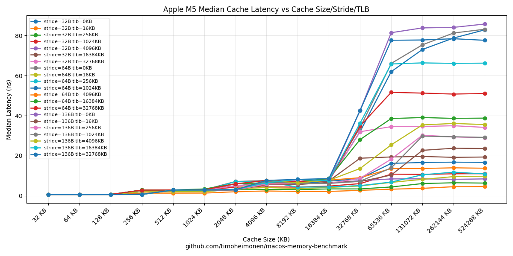
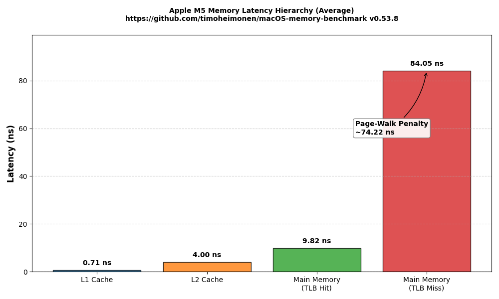

# macOS Apple Silicon Memory Benchmark

    

Copyright 2025-2026 Timo Heimonen <timo.heimonen@proton.me>  
License: GPL-3.0 license  
  
**Low-level tool** to measure memory read/write/copy bandwidth, cache/main memory latency, and access pattern performance on macOS Apple Silicon (ARM64).

  
Macbook Air M5 Cache Latency by example-script provided. Using different size TLB locality and Stride size. 

  
Macbook Air M5 memory latency from [JSON file](results/0.53.8/MacbookAirM5_benchmark.json)  
DRAM TLB-hit ~9,8ns is really nice!  
More Apple Silicon M5 results in [/results/0.53.8/ -folder](results/0.53.8/)

## Description

`memory_benchmark` measures memory behavior on macOS Apple Silicon with an implementation focused on practical low-level analysis:

1. Main memory bandwidth (read/write/copy).
2. Cache bandwidth (L1/L2 auto-detected, or custom cache target).
3. Main memory latency (dependent pointer chase).
4. Cache latency (dependent pointer chase).
5. Pattern bandwidth behavior (sequential, strided, random).

The benchmark uses ARM64 assembly kernels, warmup passes, and loop statistics to produce stable and comparable results.

## Why This Tool?

This project is built to characterize Apple Silicon memory behavior in a direct and reproducible way.

Compared to generic benchmark suites, it is intentionally focused on:

- Native ARM64 execution on macOS.
- Cache-aware and latency-aware test paths.
- Explicit mode control for bandwidth-only, latency-only, and pattern-only workflows.
- JSON output that is easy to automate and plot.

## Disclaimer

**Use this software at your own risk.** It performs sustained, intensive memory operations. The author is not responsible for instability, data loss, or hardware issues resulting from use.

## Target Platform

- macOS
- Apple Silicon (ARM64)

## Install with Homebrew

```bash
brew install timoheimonen/macOS-memory-benchmark/memory-benchmark
```

## Build from Source

Prerequisites:

- Xcode Command Line Tools (`xcode-select --install`)

Build:

```bash
git clone https://github.com/timoheimonen/macOS-memory-benchmark.git
cd macOS-memory-benchmark
make
```

Run from source tree (without installing to `PATH`):

```bash
./memory_benchmark -h
```

## Testing

Install test dependency:

```bash
brew install googletest
```

Run unit tests:

```bash
make test
```

## Quick Usage

Examples below use the Homebrew/`PATH` form (`memory_benchmark ...`).
If you are running directly from a local source build, use `./memory_benchmark ...`.

Help:

```bash
memory_benchmark -h
```

Default run:

```bash
memory_benchmark
```

For longer runs, prevent sleep:

```bash
caffeinate -i -d memory_benchmark -count 10 -buffersize 1024
```

## Benchmark Modes

- **Default mode**: Runs main bandwidth + main latency + cache bandwidth + cache latency.
- **`-patterns`**: Runs pattern bandwidth suite only (`sequential_forward`, `sequential_reverse`, `strided_64`, `strided_4096`, `strided_16384`, `strided_2mb`, `random`).
- **`-only-bandwidth`**: Runs bandwidth paths only (`-patterns`, `-cache-size`, and `-latency-samples` are not allowed in this mode).
- **`-only-latency`**: Runs latency paths only (`-patterns` and `-iterations` are not allowed in this mode).
- **`-analyze-tlb`**: Runs standalone TLB analysis mode; only optional `-output <file>`, `-latency-stride-bytes <bytes>`, and `-latency-chain-mode <mode>` may be combined with it.
- **`-analyze-core2core`**: Runs standalone core-to-core cache-line handoff analysis mode; only optional `-output <file>`, `-count <count>`, and `-latency-samples <count>` may be combined with it. See [CORE_TO_CORE_WHITEPAPER.md](CORE_TO_CORE_WHITEPAPER.md) for methodology and JSON contract.

Latency-specific disable controls in `-only-latency`:

- `-buffersize 0` disables main-memory latency target.
- `-cache-size 0` disables cache-latency target.
- Both disabled at once is invalid.

## Most-Used Options

- `-buffersize <MB>`: Main buffer size (default `512`; auto-capped by memory safety rules).
- `-iterations <count>`: Bandwidth iterations per loop (default `1000`).
- `-count <count>`: Full benchmark repetitions (default `1`; use `5-10` for statistics).
- `-threads <count>`: Bandwidth thread count (latency tests remain single-threaded).
- `-cache-size <KB>`: Custom cache target. Non-zero range is `16` to `1048576` KB (1 GB).
- `-analyze-tlb`: Standalone TLB-boundary detection benchmark (`1024/512/256 MB` fallback buffer selection), sweeping locality windows from `max(16 KB, 2*stride)` to `256 MB` (plus optional `512 MB` page-walk comparison when buffer is at least `512 MB`). Supports optional `-latency-stride-bytes <bytes>` and `-latency-chain-mode <mode>`.
- `-analyze-core2core`: Standalone two-thread cache-line ping-pong benchmark for coherence handoff latency, with three scheduler-hint scenarios (`no_affinity_hint`, `same_affinity_tag`, `different_affinity_tags`). Reports round-trip and one-way-estimate latency plus percentiles.
- `-latency-samples <count>`: Samples per latency test (default `1000`).
- `-latency-stride-bytes <bytes>`: Pointer-chain stride for latency tests (default `64`; must be > 0 and pointer-size aligned).
- `-latency-chain-mode <mode>`: Pointer-chain construction policy. Modes: `auto` (default), `global-random`, `random-box`, `same-random-in-box`, `diff-random-in-box`.
- `-latency-tlb-locality-kb <KB>`: Pointer-chain locality window (default `16`; `0` = global random chain; non-zero values must be page-size multiples). If omitted, regular main-memory latency output also includes an automatic TLB comparison (`16 KB` hit-biased vs `0` miss-biased) and estimated page-walk penalty.
- `-non-cacheable`: Best-effort cache-discouraging hints (not true uncached memory).
- `-output <file>`: Save JSON output.

## Typical Workflows

Statistical baseline:

```bash
caffeinate -i -d memory_benchmark -count 10 -buffersize 1024 -output baseline.json
```

Pattern analysis:

```bash
memory_benchmark -patterns -count 10 -buffersize 512 -output patterns.json
```

Latency locality comparison:

```bash
memory_benchmark -only-latency -buffersize 1024 -count 10 -latency-samples 5000 -latency-tlb-locality-kb 16 -output lat_tlb16.json
memory_benchmark -only-latency -buffersize 1024 -count 10 -latency-samples 5000 -latency-tlb-locality-kb 0 -output lat_global.json
```

Regular benchmark with automatic DRAM TLB breakdown (omit `-latency-tlb-locality-kb`):

```bash
memory_benchmark -latency-stride-bytes 128 -count 1
```

TLB-vs-cache isolation (smaller stride within pages):

```bash
memory_benchmark -only-latency -buffersize 1024 -cache-size 4096 -latency-stride-bytes 64 -latency-tlb-locality-kb 16 -count 10 -latency-samples 5000 -output lat_stride64_tlb16.json
```

Custom cache target:

```bash
memory_benchmark -cache-size 4096 -threads 1 -count 5 -output cache_4mb.json
```

Standalone TLB analysis report:

```bash
memory_benchmark -analyze-tlb
```

Standalone TLB analysis with JSON export:

```bash
memory_benchmark -analyze-tlb -output tlb_analysis.json
```

Standalone TLB analysis with custom stride:

```bash
memory_benchmark -analyze-tlb -latency-stride-bytes 128 -output tlb_analysis_stride128.json
```

Standalone core-to-core handoff analysis:

```bash
memory_benchmark -analyze-core2core
```

Standalone core-to-core handoff analysis with JSON export and custom sample depth:

```bash
memory_benchmark -analyze-core2core -count 5 -latency-samples 2000 -output core2core.json
```

## Output Overview

Console output includes:

- Resolved configuration and cache information.
- Per-loop benchmark results.
- Main-memory latency may include automatic TLB breakdown lines (`TLB hit latency`, `TLB miss latency`, and `Estimated page-walk penalty`) when `-latency-tlb-locality-kb` is not explicitly set.
- Aggregate statistics when `-count > 1` (including P50/P90/P95/P99 and stddev). In auto-TLB mode, statistics also include `TLB Hit Latency (ns)`, `TLB Miss Latency (ns)`, and `Estimated Page-Walk Penalty (ns)`.

JSON output shape:

- Standard mode:

```json
{
  "configuration": {},
  "execution_time_sec": 0,
  "main_memory": {},
  "cache": {},
  "timestamp": "...",
  "version": "..."
}
```

- Pattern mode:

```json
{
  "configuration": {},
  "execution_time_sec": 0,
  "patterns": {},
  "timestamp": "...",
  "version": "..."
}
```

Current latency payload is nested (not scalar):

```json
"latency": {
  "average_ns": {
    "values": [],
    "statistics": {}
  },
  "samples_ns": {
    "values": [],
    "statistics": {}
  },
  "auto_tlb_breakdown": {
    "tlb_hit_ns": {
      "values": [],
      "statistics": {}
    },
    "tlb_miss_ns": {
      "values": [],
      "statistics": {}
    },
    "page_walk_penalty_ns": {
      "values": [],
      "statistics": {}
    }
  }
}
```

## Visualization Workflow

Run cache/locality sweep script:

```bash
./script-examples/latency_test_script.sh
```

Plot extracted percentile trends from `script-examples/final_output.txt`:

```bash
python3 script-examples/plot_cache_percentiles.py script-examples/final_output.txt --metric median
```

Supported metrics: `median`, `p90`, `p95`, `p99`, `average`, `min`, `max`, `stddev`.

Note: `script-examples/latency_test_script.sh` invokes `memory_benchmark` from `PATH`. If you only built locally as `./memory_benchmark`, either install it or update `BENCHMARK_CMD` in the script.

## Interpreting Results Under Active System Load

If other macOS programs are heavily active, treat results as contention-influenced.

Recommended interpretation approach:

1. Keep background load profile consistent across compared runs.
2. Use repeated loops (`-count 10` or more).
3. Prioritize median and tail percentiles (`P95`/`P99`) over single-run extremes.
4. Keep command lines identical when comparing machines or builds.

The measured bandwidth can be close to platform theoretical limits under favorable conditions. For example,
`results/0.53.7/MacMiniM4_benchmark.json` reports ~`115.87 GB/s` average main-memory read on Apple M4 versus
~`120 GB/s` theoretical peak (about `97%`). Treat this as an empirical reference, not a guaranteed ceiling.

Reference sample result files in this repository:

- `results/0.53.7/MacMiniM4_benchmark.json`
- `results/0.53.7/MacMiniM4_patterns.json`

## Documentation

- **[User Manual](MANUAL.md)**: full usage guide, option reference, workflows, troubleshooting.
- **[Technical Specification](TECHNICAL_SPECIFICATION.md)**: architecture, execution flow, memory model, output contracts.
- **[Latency Whitepaper](LATENCY_WHITEPAPER.md)**: dependent pointer-chase design, chain construction, and sampling methodology.
- **[TLB Analysis Whitepaper](TLB_ANALYSIS_WHITEPAPER.md)**: standalone `-analyze-tlb` methodology, boundary/guard rules, confidence model, and JSON verification contract.
- **[Core-to-Core Cache-Line Handoff Latency Whitepaper](CORE_TO_CORE_WHITEPAPER.md)**: standalone `-analyze-core2core` methodology, LDAR/STLR assembly protocol, scheduler-hint scenarios, and JSON contract.

## Non-Goals

Here are some things what are not goals to this application.
- Support other than Apple Silicon systems
- GUI
- Server backend / top score tables

## Limitations and Caveats

- `-non-cacheable` is best effort only (`madvise` hints); it does not create true uncached mappings.
- Small buffers can be cache-dominated, so they may not represent DRAM behavior.
- Apple Silicon user space has no explicit data-cache flush primitive equivalent to x86 `CLFLUSH` for strict cold-cache control.
- TLB-locality mode controls pointer-chain construction policy; it does not directly control hardware TLB residency.
- Background activity, thermals, and scheduling can materially affect tails and variance.
