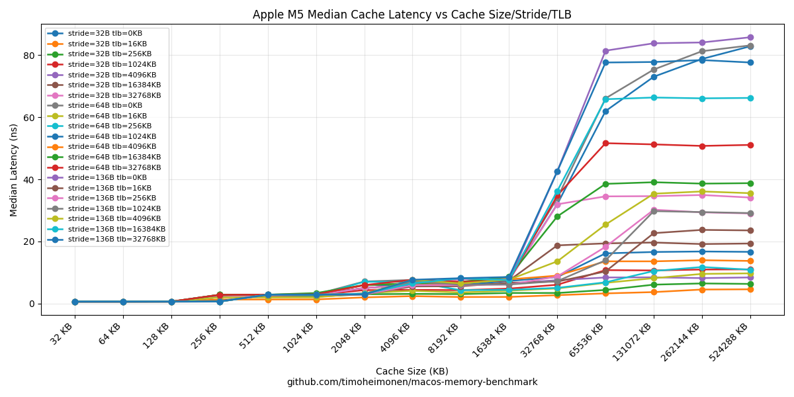

# macOS Memory Benchmark

     [](https://github.com/timoheimonen/macOS-memory-benchmark/actions/workflows/pr-tests.yml)

`memory_benchmark` is a low-level command-line tool for measuring CPU and Metal GPU memory bandwidth, synthetic LLM
decode and prefill memory traffic, cache and main-memory latency, access-pattern performance, TLB behavior, and
two-thread cache-line handoff protocol latency on Apple Silicon Macs.

It is designed for controlled microarchitectural investigation rather than a single synthetic score. CPU measurement
paths use native ARM64 kernels; the standalone GPU and LLM Metal modes use runtime-compiled Metal compute kernels. Runs
expose calibration, workload, completion, and repeatability metadata so results can be audited and compared.



*Cache latency on a MacBook Air M5 across working-set sizes, pointer strides, and TLB-locality configurations. Generated from multiple JSON result files using the included plotting tools.*

## Why This Tool?

- **Apple Silicon native:** C++17 and ARM64 assembly measurement paths for macOS.
- **Bandwidth and latency:** main-memory and cache read/write/copy throughput plus dependent pointer-chase latency.
- **Access-pattern analysis:** sequential, reverse, strided, and random workloads with exact effective-payload accounting.
- **Dedicated TLB analysis:** paired spread/packed chains, adaptive rounds, confidence intervals, and independent boundary validation.
- **Core-to-core analysis:** calibrated acquire/release token-exchange measurements under scheduler-hint scenarios.
- **Metal GPU bandwidth:** standalone read/write/copy compute kernels with GPU timestamps and validation metadata.
- **Synthetic LLM memory profile:** CPU and capability-gated Metal measurements of fixed-context decode and full-prompt
  prefill with contiguous or deterministic paged KV.
- **Reproducible experiments:** explicit seeds, repeated loops, built-in Cartesian parameter sweeps, recoverable JSON
  file checkpoints, and final machine-readable stdout for every result-producing direct mode and CPU sweep.

See [Measurement Capabilities](documents/CAPABILITIES.md) for the full measurement scope and interpretation guidance.

## Platform Requirements

- macOS 26 or later on Apple Silicon (ARM64)
- Xcode Command Line Tools for source builds
- GoogleTest from Homebrew for the test suite
- Python 3 for the script-example entry test included in the aggregate `make test-all` gate; `jq` is optional for JSON
  inspection and the jq-backed latency-script path
- Metal modes: a unified-memory device with `MTLGPUFamilyApple7` or compatible later-family capability; LLM Metal also
  requires Tier 2 argument buffers and `maxBufferLength >= 256 MiB`

The build targets macOS 26.0 and links the system Metal and Foundation frameworks. GPU kernels are embedded MSL 2.3
source compiled at runtime, so the optional offline Metal Toolchain is not required. Passing a Metal capability check
admits the runtime contract; it does not by itself establish a validated hardware baseline.

Source builds require an Xcode toolchain and macOS SDK that recognize the macOS 26 deployment target. `GTEST_DIR` may
select another GoogleTest installation, whose static archives must not require a newer macOS version than the build.

## Install

Homebrew:

```bash
brew install timoheimonen/macOS-memory-benchmark/memory-benchmark
```

Build from source:

```bash
git clone https://github.com/timoheimonen/macOS-memory-benchmark.git
cd macOS-memory-benchmark
make
```

When using a source build without installing it to `PATH`, replace `memory_benchmark` in the examples with `./memory_benchmark`.

## Quick Start

Show the complete command-line reference:

```bash
memory_benchmark -h
```

Run the standard CPU bandwidth and latency benchmark:

```bash
memory_benchmark --benchmark
```

Run the standalone Metal GPU bandwidth suite:

```bash
memory_benchmark --gpu-bandwidth
```

Run a bounded fixed-work synthetic LLM decode-memory profile:

```bash
memory_benchmark --llm-memory --weight-size-mb 64 --layers 4 \
  --query-heads 8 --kv-heads 2 --head-dim 64 --context-tokens 512 \
  --iterations 1 --count 3
```

Run the same three synthetic decode scenarios on Metal with contiguous KV:

```bash
memory_benchmark --llm-memory --llm-memory-backend metal \
  --weight-size-mb 64 --layers 4 --query-heads 8 --kv-heads 2 \
  --head-dim 64 --context-tokens 512 --iterations 1 --count 3
```

Metal LLM-memory is runtime-capability-gated. It uses GPU command-buffer timestamps, accepts no `--threads` option, and
never falls back to CPU.

Run a tiled-prefix prefill operation on Metal with contiguous KV:

```bash
memory_benchmark --llm-memory --llm-memory-backend metal \
  --weight-size-mb 64 --layers 4 --query-heads 8 --kv-heads 2 \
  --head-dim 64 --phase prefill --prompt-tokens 512 \
  --attention-query-tile-tokens 64 --iterations 1 --count 3
```

Select deterministic paged KV for the same Metal prefill workload:

```bash
memory_benchmark --llm-memory --llm-memory-backend metal \
  --weight-size-mb 64 --layers 4 --query-heads 8 --kv-heads 2 \
  --head-dim 64 --phase prefill --prompt-tokens 512 \
  --attention-query-tile-tokens 64 --kv-layout paged \
  --kv-block-tokens 16 --iterations 1 --count 3 --seed 42
```

Run bounded paged decode on Metal with a reproducible block-table permutation:

```bash
memory_benchmark --llm-memory --llm-memory-backend metal \
  --weight-size-mb 64 --layers 4 --query-heads 8 --kv-heads 2 \
  --head-dim 64 --context-tokens 513 --kv-layout paged \
  --kv-block-tokens 16 --iterations 1 --count 3 --seed 42
```

Select the paged KV layout with an explicit power-of-two block size in tokens:

```bash
memory_benchmark --llm-memory --weight-size-mb 64 --layers 4 \
  --query-heads 8 --kv-heads 2 --head-dim 64 --context-tokens 512 \
  --kv-layout paged --kv-block-tokens 16 --iterations 1 --count 3 --seed 42
```

Run one full-prompt prefill operation per scenario with two-token attention query tiles:

```bash
memory_benchmark --llm-memory --weight-size-mb 64 --layers 4 \
  --query-heads 8 --kv-heads 2 --head-dim 64 --phase prefill \
  --prompt-tokens 512 --attention-query-tile-tokens 2 \
  --iterations 1 --count 3
```

For longer runs, prevent system sleep and collect repeated measurements:

```bash
caffeinate -i -d memory_benchmark --benchmark --count 10 --buffer-size 1024 --output baseline.json
```

For automation, every result-producing direct mode and the CPU modes' supported sweeps accept the exact output target
`-`. JSON is written once to stdout and the human-readable transcript is written to stderr:

```bash
memory_benchmark --benchmark --only-bandwidth --count 5 --buffer-size 512 --output - \
  >benchmark.json 2>benchmark.log
```

An empty output value disables JSON for a direct command but is missing/invalid for a sweep. Every other non-empty value
is a file target, including `./-` and flag-shaped names such as `-G`. Use a real file when crash-resilient intermediate
checkpoints are required; see the [Machine-Readable CLI API](documents/API.md) support matrix and acceptance contract.

## Benchmark Modes

| Mode | Purpose |
|---|---|
| `--benchmark` | Calibrated and balanced standard CPU benchmark for main-memory and cache bandwidth plus continuous-pass latency. Use `--only-bandwidth` or `--only-latency` to narrow the run. |
| `--patterns` | Effective read/write/copy bandwidth for sequential-forward, sequential-reverse, 64 B, 4096 B, 16384 B and 2 MiB virtual strides, and random access. |
| `--analyze-tlb` | Standalone paired spread/packed TLB analysis with adaptive measurement rounds, confidence intervals, and boundary validation. |
| `--analyze-core2core` | Calibrated two-thread acquire/release token-protocol round-trip latency under best-effort macOS scheduler hints. |
| `--gpu-bandwidth` | Standalone Metal GPU read/write/copy effective compute-payload bandwidth. |
| `--llm-memory` | Standalone synthetic LLM memory profile: CPU or Metal decode/prefill with contiguous or paged KV. |
| `--sweep <key=a,b>` | Cartesian parameter sweep for supported CPU, pattern, TLB, and core-to-core modes; requires `--output`. GPU schema 1 and LLM schema 1 do not support sweeps. |

Primary modes are intentionally separate and accept different option sets. Use `memory_benchmark -h` or the [User Manual](documents/MANUAL.md) for defaults, valid combinations, and the complete option reference.

LLM-memory requires explicit model and phase geometry. CPU and capability-gated Metal backends support decode and
prefill with contiguous or deterministic paged KV; Metal rejects explicit `--threads` and never falls back to CPU.
See the [User Manual](documents/MANUAL.md#--llm-memory) for the complete option matrix, defaults, validation rules, and
workflows. The [LLM Memory Profile Whitepaper](documents/LLM_MEMORY_PROFILE_WHITEPAPER.md) defines the exact payload
formulas, timed boundaries, paged lookup accounting, validation, schema evidence, and comparison protocol.

When `--iterations` is omitted, bandwidth, pattern, GPU, and LLM workloads calibrate toward bounded measurement
durations; an explicit value selects fixed work. Standard latency headlines use a separate continuous pointer-chase
pass and are not derived from the sampled latency distribution. See the [User Manual](documents/MANUAL.md) for the
per-mode calibration and sampling details.

## Representative Workflows

Repeated CPU baseline with JSON output:

```bash
caffeinate -i -d memory_benchmark --benchmark --count 10 --buffer-size 1024 --output baseline.json
```

Reproducible access-pattern comparison:

```bash
memory_benchmark --patterns --count 10 --buffer-size 512 --seed 123456789 --output patterns.json
```

Latency sweep over buffer size and pointer-chain locality:

```bash
memory_benchmark --benchmark --only-latency --count 5 \
  --sweep buffer-size=256,512,1024 \
  --sweep latency-tlb-locality-kb=16,1024,0 \
  --output latency_sweep.json
```

The same sweep can be consumed as one final schema-1 envelope on stdout by changing the target to `--output -`. Use a
real file when recoverable per-attempt checkpoints are required.

Standalone TLB analysis:

```bash
memory_benchmark --analyze-tlb --seed 123456789 --output tlb_analysis.json
```

Core-to-core handoff analysis with deeper sampling:

```bash
memory_benchmark --analyze-core2core --count 5 --latency-samples 2000 --output core2core.json
```

Reproducible fixed-work GPU run:

```bash
caffeinate -i -d memory_benchmark --gpu-bandwidth --buffer-size 512 \
  --iterations 24 --count 9 --seed 123456789 --output gpu_bandwidth.json
```

The same GPU schema 1 payload can be captured as final-only stdout:

```bash
memory_benchmark --gpu-bandwidth --buffer-size 512 --count 3 --seed 42 --output - \
  >gpu_bandwidth.json 2>gpu_bandwidth.log
```

Reproducible fixed-work LLM memory profile with atomic scenario and command-terminal file checkpoints:

```bash
caffeinate -i -d memory_benchmark --llm-memory --weight-size-mb 4096 --layers 32 \
  --query-heads 32 --kv-heads 8 --head-dim 128 --context-tokens 8192 \
  --iterations 1 --count 3 --seed 42 --output llm_memory.json
```

To measure the same logical decode geometry through a seeded paged layout, add:

```text
--kv-layout paged --kv-block-tokens 16
```

For prefill, replace the decode context with explicit prompt/tile geometry:

```text
--phase prefill --prompt-tokens 8192 --attention-query-tile-tokens 128
```

Add `--kv-layout paged --kv-block-tokens 16` to combine that prefill geometry with deterministic paged KV.

The same schema 1 payload can be captured once from final-only stdout:

```bash
memory_benchmark --llm-memory --weight-size-mb 64 --layers 4 \
  --query-heads 8 --kv-heads 2 --head-dim 64 --context-tokens 512 \
  --iterations 1 --count 3 --seed 42 --output - \
  >llm_memory.json 2>llm_memory.log
```

More workflows, including custom cache targets, latency-chain controls, density profiles, and sweep keys, are documented in the [User Manual](documents/MANUAL.md).

## Interpreting Results

Treat benchmark values as measurements of the configured workload under the observed system conditions, not as immutable hardware specifications.

- Use identical commands, seeds, software versions, and system conditions when comparing runs.
- Prefer repeated loops. When `--count > 1`, the median (P50) is the headline; output also reports tail percentiles and variability metrics where applicable.
- Keep background load, power state, and thermal conditions consistent. Scheduling and other macOS activity can materially affect latency tails and variance.
- Use sufficiently large buffers for main-memory-focused CPU experiments. Small working sets can be cache-dominated,
  while buffer size alone does not prove physical DRAM service.
- `--non-cacheable` applies best-effort cache-discouraging `madvise` hints; it does not create truly uncached memory.
- Pattern GB/s is exact **effective kernel payload bandwidth**, not observed physical cache-bus or DRAM traffic. `strided_2mb` describes a 2 MiB virtual-address stride and does not prove superpage backing.
- GPU GB/s is exact **effective compute-payload bandwidth** divided by Metal GPU time. Private storage is unified memory rather than separate VRAM, copy counts aggregate read plus write payload, and physical DRAM residency remains unverified.
- CPU and GPU GB/s values are not directly comparable: the kernels, timing boundaries, parallelism, resource modes, and validation work differ.
- LLM GB/s is exact **logical effective model payload** divided by backend-authoritative scenario time: synchronized
  worker time for CPU or `GPUStartTime`/`GPUEndTime` for Metal. Decode uses a fixed context that
  includes the current token; CPU and Metal prefill rewrite a complete prompt then scan tiled causal
  prefixes. The logical prefill schedule writes tokens in ascending order, K then V for each token, before tiled reads.
  CPU owners and Metal lanes read only their written byte ranges, with complete K ranges before V ranges per tile.
  CPU profiles use full-size ordinary cacheable mappings; Metal uses exact-tail private/tracked segments on unified
  memory. None of those properties proves physical DRAM service. In paged mode, uint32 block-table loads occur inside
  the timed CPU assembly or Metal kernel path, but their bytes are reported as layout metadata and excluded from the
  effective-model-payload GB/s numerator. Weights-only and KV-only are component baselines, while mixed is one timed
  workload and must not be split into independent weight- and KV-bandwidth claims.
- An LLM synthetic memory work unit is one decode step or one full-prompt prefill operation, not an inference token.
  Prefill does not predict TTFT. The profile excludes Transformer compute, framework dispatch,
  compute-memory overlap, ANE paths, GPU execution outside the defined Metal kernels, runtime page allocation,
  prefix sharing, sliding-window KV, growing context, and model loading.
- The LLM traffic classification version `llm-exact-weight-vs-kv-read-payload-v1` compares exact weight and KV-read
  bytes only. `near_crossover` means exact equality and is not a measured hardware-bottleneck claim.
- The repository includes two
  [Apple M5 CPU-decode working-set samples recorded with 0.63.0](results/0.63.0/AppleM5_LLM_working_set_scaling.md)
  with links to their complete JSON records. They illustrate scaling across 384 MiB and 1,536 MiB data mappings.
- TLB-locality controls pointer-chain construction, not hardware TLB residency. Standard locality comparisons combine cache, locality, and translation effects; use `--analyze-tlb` for controlled translation-boundary conclusions.
- Core-to-core results are scheduler-influenced acquire/release token-protocol measurements. They do not directly observe
  physical cache-line migration or isolate coherence-fabric latency, and macOS user space cannot guarantee physical core
  pinning.

JSON output records completion and nullable measurement state instead of using zero for unavailable results. Current
standard schema 3 requires `configuration.mode: "benchmark"`, a string `configuration.output_file` that preserves the
raw output target, plus boolean `results_complete` and `conclusions_valid` fields. The bundled standard-memory examples
accept compatible producer releases by checking the standard mode, schema 3, the exact
`benchmark-v2-calibrated-seeded-balanced` methodology, completion state, and the shape of the fields they consume.
They retain the top-level `version` as provenance but do not require a particular software release. They do not
translate released standard schema 2, unversioned historical standard JSON layouts, or other methodology identities.
Consumers making conclusions should reject incomplete or interrupted runs according to the mode-specific status fields.
Every result-producing direct command or CPU sweep using `--output -` reserves stdout for one final JSON document and
routes its post-parse human transcript to stderr; file output is atomic. LLM file output checkpoints after each terminal
scenario measurement and at command terminal, while its stdout checkpoints remain logical lazy transitions followed by
one final document. Exact process acceptance rules are in the
[Machine-Readable CLI API](documents/API.md), with schema and checkpoint details in the
[User Manual](documents/MANUAL.md), [Technical Specification](documents/TECHNICAL_SPECIFICATION.md), and mode
whitepapers.

## Plotting Results

The repository includes scripts for cache/locality sweeps and percentile plots. Plotting requires Python 3 and `matplotlib`; the M4/M5 comparison script also uses `numpy`.

```bash
python3 -m pip install matplotlib numpy
./script-examples/latency_test_script.sh
python3 script-examples/plot_cache_percentiles.py \
  script-examples/final_output.txt --metric median
```

The sweep script prefers the repository's local `./memory_benchmark`, then falls back to `memory_benchmark` from
`PATH`; set `BENCHMARK_CMD=/path/to/memory_benchmark` to override either choice. Whichever producer is selected must
emit a complete compatible standard schema-3 result with the expected methodology. The sweep helpers return a non-zero
status if a planned run fails or does not produce a complete, parseable result.

The two standard-result plotters require explicit compatible inputs; archived 0.53.x standard JSON is retained as
historical evidence and is not a compatible input:

```bash
python3 script-examples/plot_M4vsM5_benchmark_comparison.py \
  --m4-file current-m4.json --m5-file current-m5.json
python3 script-examples/plot_benchmark-memory-latency-hierarchy.py \
  --file current-standard.json
```

The hierarchy plotter also accepts an explicit console-text statistics file through `--file`; that separate text parser
recognizes the current console labels only and is neither JSON-schema nor historical-label compatibility. See the
[User Manual](documents/MANUAL.md#visualization-scripts) for supported inputs and metrics.

## Documentation

- [Measurement Capabilities](documents/CAPABILITIES.md): what the tool measures and how those measurements should be interpreted.
- [Machine-Readable CLI API](documents/API.md): supported output targets, stdout/stderr contract, current schemas, and result acceptance.
- [User Manual](documents/MANUAL.md): complete option reference, mode compatibility, workflows, output examples, and troubleshooting.
- [Technical Specification](documents/TECHNICAL_SPECIFICATION.md): architecture, execution flow, memory model, and output contracts.
- [Latency Whitepaper](documents/LATENCY_WHITEPAPER.md): dependent pointer-chase and sampling methodology.
- [TLB Analysis Whitepaper](documents/TLB_ANALYSIS_WHITEPAPER.md): paired analysis, boundary rules, confidence model, and JSON verification contract.
- [Core-to-Core Whitepaper](documents/CORE_TO_CORE_WHITEPAPER.md): LDAR/STLR handoff protocol, scheduler-hint scenarios, and JSON schema.
- [GPU Bandwidth Whitepaper](documents/GPU_BANDWIDTH_WHITEPAPER.md): Metal methodology, timing, validation, resource model, and interpretation limits.
- [LLM Memory Profile Whitepaper](documents/LLM_MEMORY_PROFILE_WHITEPAPER.md): generic schema-v1 vocabulary plus the
  active CPU and Metal decode/prefill traffic, timing, checksum, and interpretation contracts.
- [Apple M5 LLM CPU-decode working-set samples](results/0.63.0/AppleM5_LLM_working_set_scaling.md): two complete
  0.63.0 JSON runs and their observed working-set scaling.

Runtime behavior and `memory_benchmark -h` are the authoritative sources when documentation differs.

## Development and Testing

Install GoogleTest and run the deterministic unit suite:

```bash
brew install googletest
make test
```

Run the focused script-example entry test, real Apple Silicon integration tests, or the complete suite:

```bash
make test-script-examples
make test-integration
make test-all
```

`make test-all` requires Python 3; it runs all GTest cases followed by the focused script-example entry test. `jq` is
not required by the test gate.

Generate isolated LLVM production-source coverage reports under `/tmp`:

```bash
make coverage-unit
make coverage-all
```

See [CONTRIBUTING.md](documents/CONTRIBUTING.md) for contribution guidance and [Project Structure](documents/PROJECT_STRUCTURE.md) for
repository navigation and the current test-suite map. C++ reference documentation can be generated with `make docs`.

## Scope and Safety

This project intentionally does not target Intel Macs or other operating systems, provide a GUI, or host a public leaderboard/backend.

The benchmark performs sustained, intensive memory operations. Use it at your own risk; the author is not responsible for instability, data loss, or hardware issues resulting from use.

## License

Copyright 2025-2026 Timo Heimonen \<timo.heimonen@proton.me\>

Licensed under the [GNU General Public License v3.0 or later](LICENSE).
